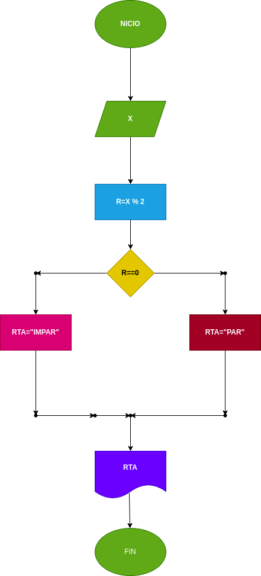

# Ejercicio No.4

## Programa para calcular operaciones aritmeticas

# ANALISIS

Variables de entrada (input)

x:Numero a digitar

RTA:variable de tipo string (texto)

Variables de proceso y salida (processing,storage,output)

MOD:El modulo de X%2

RTA: resultado de la decision
# DISEÑO

